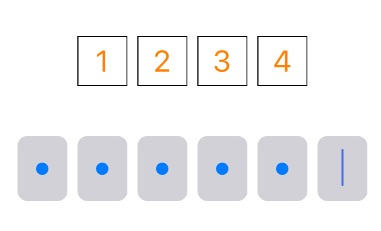
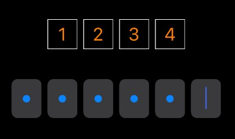

OncecodeView
===
[](https://developer.apple.com/ios/)
[](https://github.com/niyongsheng/OncecodeView/blob/master/LICENSE)
===

## Introduction:
> 验证码输入框页面组件。

## Features
- [x] [sms style]()
- [x] [pwd style]()

## Screenshot



## Usage
```ruby
  pod 'OncecodeView'

  pod install
```


## Contact Me
* E-mail: niyongsheng@Outlook.com
* Weibo: [@Ni永胜](https://weibo.com/u/7317805089)
